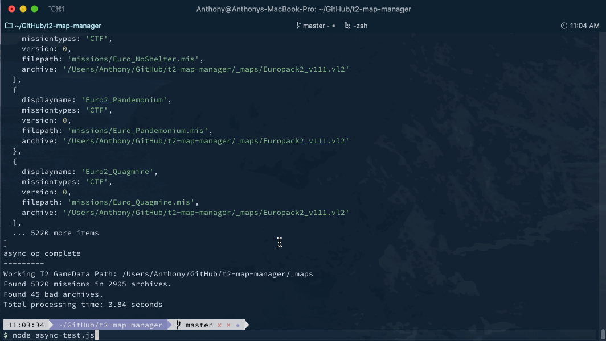

# Tribes 2 Map Manager

This project is currently an experimental proof of concept.



---

## What it does right now

    - Run through a folder and compile a list of .vl2 archives
    - After compiling a list of archives. Loop through each .vl2 and find .mis files
    - Read each .mis file and extract/save information from it

## Install / Requirements

- Tested with Node 14.15.1

```
  yarn
```

## How to Run

```
  yarn start
```

## How to Build

```
  yarn package
```

---

## Credits

[Electron React Boilerplate](https://github.com/electron-react-boilerplate)
